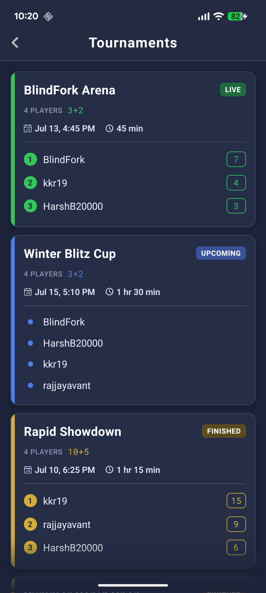
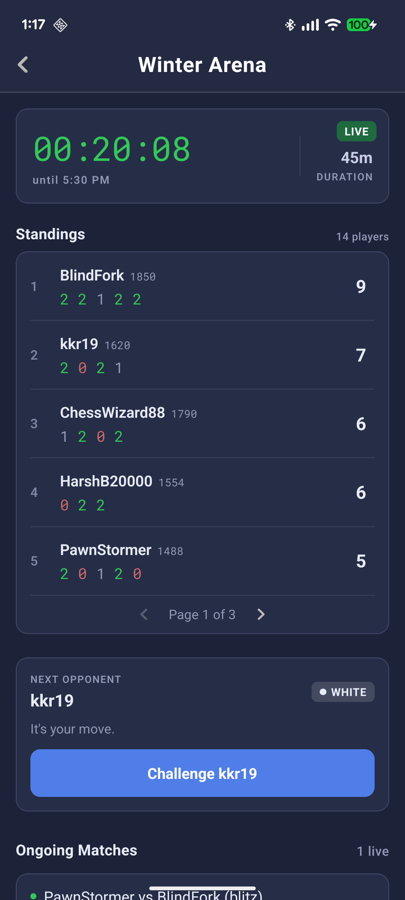
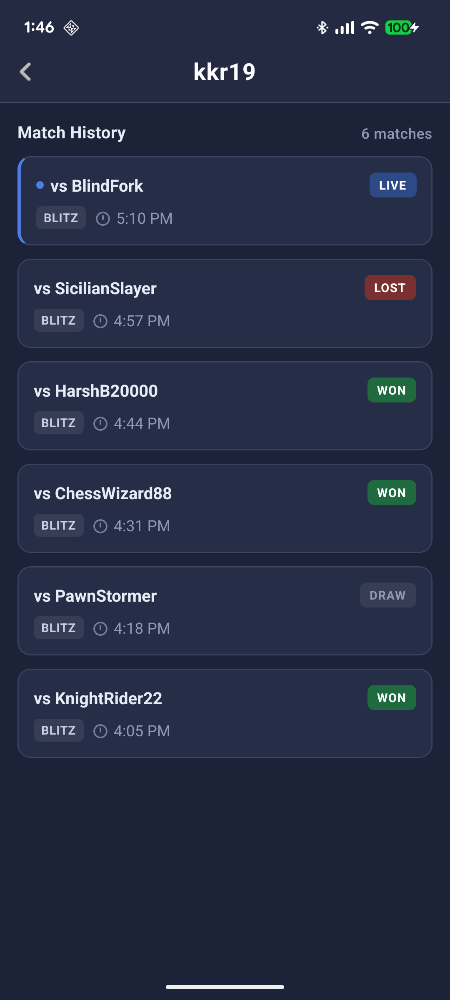

# ChessTourney

A React Native app for running casual chess tournaments among friends — with skill-based handicaps and Lichess handling verification, match results, and live standings.

The problem it solves: a casual friend group has wildly different ratings, so a plain round robin isn't fun for anyone. ChessTourney lets an organizer set up a tournament, hand out piece-odds handicaps per matchup so a 1200 and a 1800 can play a genuinely competitive game, and then tracks the whole thing — pairings, live points, match history — automatically from each player's real Lichess games.

## Screenshots

<table>
  <tr>
    <td align="center" width="33%">
      <br/>
      <sub>Tournaments List</sub>
    </td>
    <td align="center" width="33%">
      <br/>
      <sub>Live Tournament</sub>
    </td>
    <td align="center" width="33%">
      <br/>
      <sub>Player Scorecard</sub>
    </td>
  </tr>
</table>

## Highlights

- **Piece-odds handicap matchmaking** — each matchup can carry its own handicap (e.g. "rook and knight odds"), defined by which of the stronger player's pieces are removed. The app derives the correct starting FEN for both colors so it's always the *giver's* pieces that come off, no matter which side they're assigned that game.
- **Lichess-verified players** — joining a tournament requires a real Lichess username; it's checked against the Lichess API before it's accepted.
- **Live standings from real games** — the app polls each player's Lichess game history for the tournament's time window and computes a live leaderboard: win/draw/loss scoring, an optional bonus for 3+ win streaks, and which matches are currently in progress.
- **Deterministic pairing, no server** — next-opponent, color assignment, and handicap all fall out of a pure function over each player's match history, so every device in the tournament agrees without any backend to coordinate them.
- **Shareable tournaments** — a tournament can be published to a public feed and auto-imported into everyone's app, so an organizer sets it up once for the whole group.

## Technical Details

Built with React Native/TypeScript, React Navigation, and AsyncStorage-backed persistence (`DatabaseController`) — no backend server. The interesting problems were all about making that work: encoding handicaps as data, turning them into a legal starting position, and getting two independent phones to agree on a match without ever talking to each other or to a server.

### Modeling a handicap independently of color

A handicap belongs to a *matchup*, not to a color — "BlindFork gives HarshB20000 rook-and-knight odds" is true regardless of who plays white on a given day. So each tournament stores an `oddsInfo` map keyed by the two players' sorted roster indices (`"0-1"`, `"0-2"`, ...), where each entry just names the **giver** and the pieces they remove, coded by their standard starting square (`Ra`/`Rh` for the rooks, `Nb`/`Ng` for the knights, `Q`, `Pa`-`Ph`, etc.). That coding is deliberately color-agnostic — `Nb` means "the queenside knight," full stop — because which side of the board the giver actually sits on changes every game (see below).

### Generating the FEN

At match time, `buildOddsFen` builds a completely standard starting position, then deletes the giver's listed pieces from whichever back rank/pawn rank that player has actually been assigned this game. Since the giver's color flips game to game, `getMatchFen` first resolves *which* color the giver is playing this time, then hands that off to `buildOddsFen` — so the same handicap definition mirrors correctly onto either the rank-1 or rank-8 starting pieces. The result is a normal, legal FEN that Lichess accepts like any other custom-position game; the app isn't doing anything Lichess doesn't already support, just computing the right input for it.

### Pairing and color, without a server

There's no backend coordinating who plays whom — every device independently runs the same pure functions (`getNextPairing`, `getMatchColor`) over that player's own fetched Lichess game history, so two phones with the same match history always derive the same next opponent and the same colors, with nothing to sync.

That determinism is also what avoids the double-challenge problem. If both players' apps reacted to a new pairing by generating and opening a Lichess challenge link, you'd get two competing challenges fired at once. Instead, the deterministically-computed color doubles as an initiator flag: whoever's assigned **white** builds the full challenge link — opponent, FEN, time control, increment — and opens it, which sends a real challenge on Lichess; whoever's assigned **black** just opens `lichess.org` and waits, since accepting an incoming challenge needs no special link at all. Two devices, zero coordination, exactly one challenge sent every time.

## How it works

1. **Create a tournament** — pick a name, time control, start time, and roster (Lichess usernames). Optionally configure per-matchup piece-odds handicaps and a win-streak bonus.
2. **Players get verified** — a username is only accepted after `LichessController` confirms the account exists on Lichess.
3. **While it's live**, the app periodically re-fetches each player's Lichess games played during the tournament window, and recomputes:
   - a points leaderboard (win = 2, draw = 1, loss = 0, with streak bonuses if enabled),
   - who's idle and who they should be paired with next,
   - the correct color and handicap FEN for that next pairing.
4. **When the tournament's duration elapses**, it's archived with final standings, and every player's individual match history stays browsable from the results screen.

## Project Structure

```
src/
  data/controllers/   DatabaseController, LichessController
  screens/            Home, Profile, Tournaments, Create/Upcoming/Ongoing/Finished, PlayerMatches
  navigation/          React Navigation stack
  utils/              tournament pairing/scoring/odds logic, date + formatting helpers
```

## Running Locally

```sh
npm install
npm run android   # or: npm run ios (after `bundle install && bundle exec pod install`)
```

See the [React Native environment setup guide](https://reactnative.dev/docs/set-up-your-environment) if you're setting up a device/emulator for the first time.
